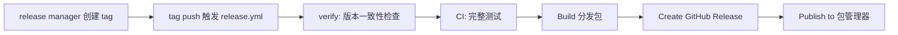

# Release Process Guide

## Versioning

遵循 Semantic Versioning 2.0：

| 版本段 | 含义 | 示例 |
|--------|------|------|
| MAJOR | 不兼容的 API 变更 | 1.0.0 → 2.0.0 |
| MINOR | 向后兼容的新功能 | 1.0.0 → 1.1.0 |
| PATCH | 向后兼容的 bug 修复 | 1.0.0 → 1.0.1 |
| -rc.N | 发布候选（Release Candidate） | 1.0.0-rc.1 |
| -hotfix.N | 紧急修复 | 1.0.0-hotfix.1 |

## Release 类型

| 类型 | 触发方式 | 工作流 | 执行步骤 |
|------|----------|--------|----------|
| **Standard** | `git tag v1.2.3` → `git push origin v1.2.3` | `release.yml` | verify → CI → build → GitHub Release → publish |
| **Pre-release** | `git tag v1.2.3-rc.1` → `git push` | `release.yml` (prerelease) | 同上，标记为 prerelease |
| **Release branch** | push `release/v*` 分支 | `release-branch.yml` | version bump → RC deploy |
| **Hotfix** | push `hotfix/v*` 分支 | `hotfix.yml` | urgent CI → deploy → tag → backport |

## Standard Release 流程



### 分步说明

1. **准备**：确认 CHANGELOG.md 已更新，所有 CI 通过
2. **打 tag**：
   ```bash
   git checkout main
   git pull origin main
   git tag -s v1.2.3 -m "v1.2.3"
   git push origin v1.2.3
   ```
3. **等待 CI**：`release.yml` 自动运行
4. **验证发布**：确认 GitHub Release 已创建、包已发布

## Hotfix 流程


### Hotfix 命名

```
hotfix/v1.2.3
```

从需要修复的最近 release tag（如 `v1.2.2`）创建：

```bash
git checkout -b hotfix/v1.2.3 v1.2.2
# 修复代码
git commit -m "fix: ..."
git push origin hotfix/v1.2.3
```

push 后自动触发 `hotfix.yml`，部署完成后自动创建 `v1.2.3-hotfix.1` tag。

## 版本一致性检查

发布时必须确保以下三处版本号一致：

```
git tag v1.2.3
     ↓ 必须一致
pyproject.toml: version = "1.2.3"
     ↓ 必须一致
CHANGELOG.md: ## [1.2.3] - 2025-06-15
```

`release.yml` 中的 `verify` job 自动执行此检查。

## Release Branch 流程（Git Flow）

当需要发布一个版本时：

```bash
git checkout develop
git checkout -b release/v1.2.0
git push origin release/v1.2.0
```

push 后 `release-branch.yml` 自动执行：
1. Version bump（确保版本号正确）
2. RC deploy（部署到 staging 验证）
3. 最终验证后，手动合并到 `main` 并打 tag

## 发布前 Checklist

参见 `templates/RELEASE_CHECKLIST.md.example`。
