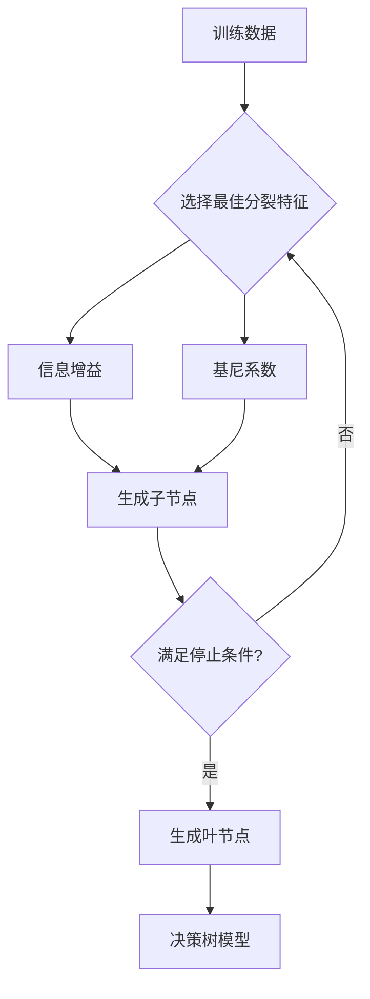
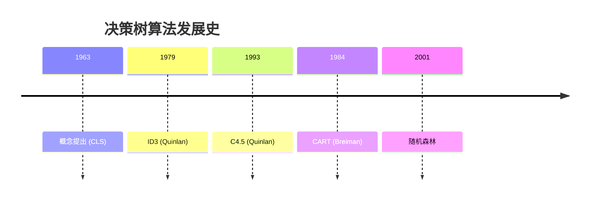
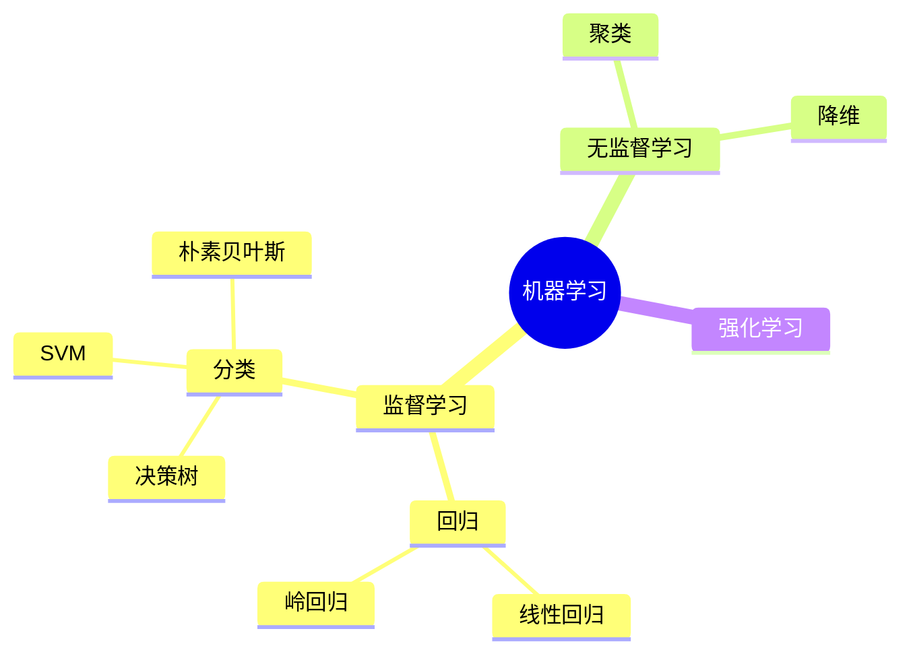

# /diagram

## Purpose

为学习笔记中的概念生成可视化图表，辅助理解和记忆。支持多种图表类型，输出 Mermaid 代码（Markdown 兼容）或图片文件。

## Usage

```
/diagram <concept>                         # 生成概念图（自动选最佳类型）
/diagram <concept> --type flowchart         # 流程图
/diagram <concept> --type timeline          # 时间线
/diagram <concept> --type comparison        # 对比图
/diagram <note> --attach                    # 为现有笔记添加图表
```

Examples:
```
/diagram 决策树构建流程
/diagram 机器学习算法分类 --type mindmap
/diagram 线性回归vs逻辑回归 --type comparison
/diagram 微积分发展史 --type timeline
/diagram notes/atoms/决策树/信息增益.md --attach
```

## Diagram Types

| 类型 | 说明 | 适用场景 | 输出格式 |
|------|------|----------|----------|
| `flowchart` | 流程图 | 算法步骤、流程、决策过程 | Mermaid |
| `mindmap` | 思维导图 | 知识体系、概念层级 | Mermaid |
| `architecture` | 架构图 | 系统架构、模型结构 | Mermaid/drawio |
| `timeline` | 时间线 | 发展历史、学习路径 | Mermaid |
| `comparison` | 对比图 | 概念对比、算法比较 | Mermaid 表格 |
| `concept` | 概念图 | 概念关系网络 | Mermaid |
| `auto` | 自动选择 | 根据内容自动判断最佳类型 | 自动 |

## Execution Logic

1. 加载 topic/note 的内容（含 source 引用）
2. 分析概念结构和关系
3. 选择最佳图表类型（或按用户指定）
4. 生成 Mermaid 代码（默认）或 drawio 图:
   - Mermaid: 直接嵌入笔记中，Markdown 兼容
   - drawio: 生成 .drawio 文件保存到 `materials/images/`
5. 将图表嵌入到目标笔记中（--attach 模式）
6. 输出: Mermaid 代码块 + 可选的图片文件

## Parameters

| Parameter | Default | Description |
|-----------|---------|-------------|
| `topic/note` | — | 概念名称或笔记路径 |
| `--type` | auto | flowchart/mindmap/architecture/timeline/comparison/concept/auto |
| `--attach` | false | 将图表追加到已有笔记中 |
| `--output` | inline | inline/file/both |

## Output Examples

### 流程图 (flowchart)

````markdown

````

### 对比图 (comparison)

```markdown
| 维度 | 线性回归 | 逻辑回归 |
|------|----------|----------|
| 任务类型 | 回归 | 分类 |
| 输出范围 | (-∞, +∞) | (0, 1) |
| 损失函数 | MSE | 交叉熵 |
| 决策边界 | 线性 | 线性 |

[Source: Lecture5-线性回归.mp4, 12:35]
```

### 时间线 (timeline)

````markdown

````

### 思维导图 (mindmap)

````markdown

````

## Strict Mode Behavior

- 图表中的信息必须基于源材料
- 在图表下方标注来源引用
- 无源材料的推断关系标注 `[inference]`
- 对比表中的对比项必须有来源支撑
