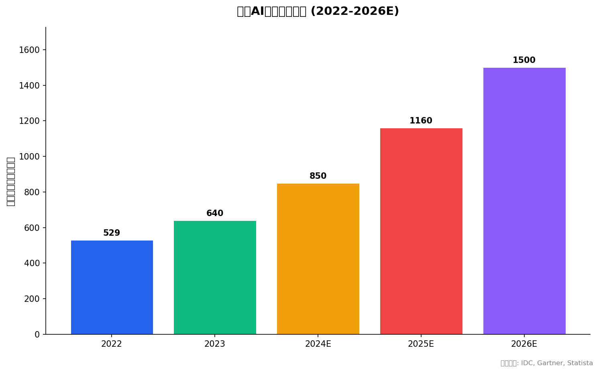
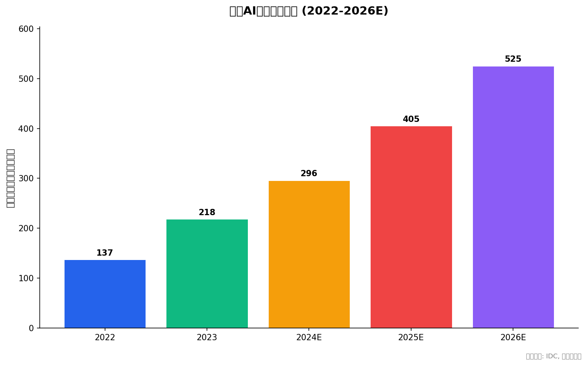
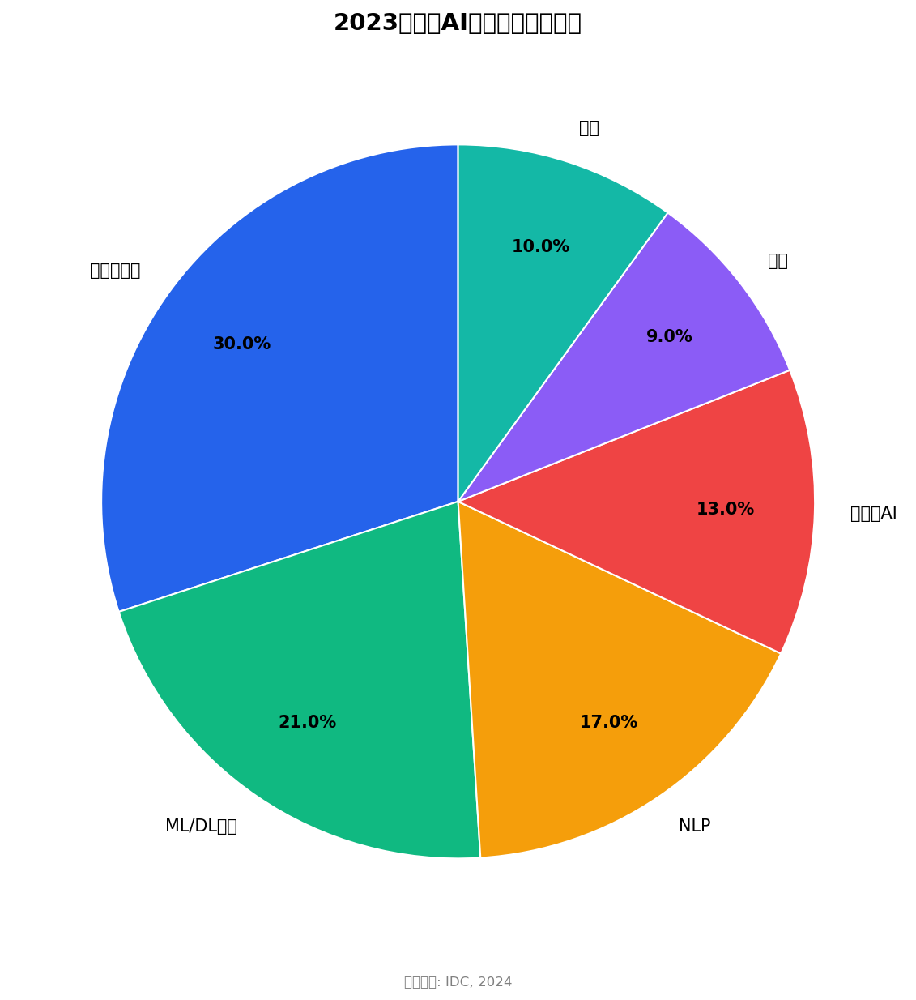

# 📄 行业全景报告：AI软件行业

> **分析师判断**：AI软件行业正处于"从技术驱动转向商业驱动"的关键转折期。全球市场CAGR>30%，生成式AI是最大增量。未来3年基础模型层寡头化、应用层百花齐放、中间层工具链整合。

---

## 目录

1. [行业界定](#1-行业界定)
2. [市场分析](#2-市场分析)
3. [竞争格局](#3-竞争格局)
4. [产业链分析](#4-产业链分析)
5. [技术趋势](#5-技术趋势)
6. [政策环境](#6-政策环境)
7. [成功关键要素](#7-成功关键要素)
8. [结论与展望](#8-结论与展望)

---

## 1. 行业界定

### 核心判断

AI软件行业已从技术探索期进入规模化应用期，覆盖从底层基础设施软件到上层应用的全栈生态。行业边界日益模糊——传统软件正在加速嵌入AI功能。

### 定义

AI软件指**嵌入人工智能算法或提供AI能力支撑的软件产品与服务**，不包括AI硬件（芯片、服务器等）。

### 细分领域

| 细分领域 | 核心内容 | 代表玩家 |
|:---------|:---------|:---------|
| **AI基础平台软件** | ML/DL框架（PyTorch、TensorFlow）、训练平台、推理引擎 | Meta、Google、NVIDIA |
| **AI中间件与工具链** | 数据标注、特征工程、MLOps、Prompt管理 | Databricks、Dataiku、Hugging Face |
| **AI应用软件** | CV（安防/医疗）、NLP（客服/翻译）、语音、推荐系统 | OpenAI、Microsoft、Google、百度、科大讯飞 |
| **生成式AI软件** | 大模型应用（ChatGPT、Claude）、AIGC工具、AI Agent | OpenAI、Anthropic、字节跳动、智谱AI |
| **AI平台服务** | AI PaaS、MaaS、低代码AI平台 | Azure AI、Vertex AI、AWS Bedrock |

[来源: Stanford CRFM, 2024]

---

## 2. 市场分析

### 核心判断

AI软件市场处于高速增长期（CAGR >30%），2026年全球约1,200-1,830亿美元。中国增速略快于全球，但绝对规模占全球仅5-6%。生成式AI是最大增量引擎。

### 全球市场规模


*图表1：全球AI软件市场规模趋势（亿美元）[来源: IDC, Gartner, Statista]*

| 年份 | 市场规模（亿美元） | 主要来源 |
|:----:|:----------------:|:---------:|
| 2022 | 529 | [IDC, 2023] |
| 2023 | 640 | [IDC, 2024] |
| 2024E | 780-920 | [IDC, 2025; Gartner, 2024] |
| 2025E | 970-1,350 | [Gartner, 2024; IDC, 2025] |
| 2026E | 1,200-1,830 | [Statista, 2025; IDC, 2025] |

> 注：不同机构统计口径不同，图中取多源中位数。IDC口径偏商业AI软件，Gartner包含AI+基础设施软件，Statista口径最宽。

**增长率**：全球CAGR 31.2%（2022-2027）[IDC, 2023]。Bloomberg Intelligence预测2024-2029年CAGR达到33.2%，主要由生成式AI带动 [Bloomberg Intelligence, 2025]。

### 中国市场规模

| 年份 | 市场规模（亿元） | 全球占比 | 主要来源 |
|:----:|:---------------:|:--------:|:---------:|
| 2022 | 137 | ~3.6% | [IDC, 2023] |
| 2023 | 218 | ~4.7% | [IDC, 2024] |
| 2024E | 296 | ~5.3% | [中国信通院, 2024] |
| 2025E | 390-420 | ~5.6% | [IDC, 2025; 艾瑞咨询, 2025] |
| 2026E | 510-540 | ~5.8% | [中国信通院, 2024; IDC, 2025] |


*图表2：中国AI软件市场规模趋势（亿元人民币）[来源: IDC, 中国信通院]*

中国AI软件CAGR约23-25%（2023-2027），显著快于全球但绝对规模仍小 [IDC, 2024; 赛迪顾问, 2025]。2025Q1中国AI软件市场已达108亿元，全年预计超420亿元，其中大模型相关占比55% [艾瑞咨询, 2025]。

### 细分市场结构（2023年全球）


*图表3：2023年全球AI软件细分市场分布 [来源: IDC, 2024]*

**关键变化**：生成式AI从2023年占AI软件市场约13%迅速攀升至2024年约19.5%（约153亿美元）[IDC, 2025]。预计2025年将超过25% [Gartner, 2024]。

中国细分市场结构与全球类似，但计算机视觉比重更高（34%），与安防、智慧城市等ToG应用场景有关 [IDC, 2024b]。

### 市场驱动因素

| 驱动因素 | 解释 |
|:---------|:-----|
| **生成式AI爆发** | ChatGPT引爆需求，企业竞相部署AI能力 |
| **数字化转型深化** | AI从试点走向规模化部署，预算持续增加 |
| **开源模型降低门槛** | Llama、Qwen等开源模型催生大量AI原生应用 |
| **政策支持** | 中国/欧盟/美国等主要经济体加大AI产业扶持力度 |
| **推理效率提升** | 模型压缩、量化技术降低部署成本 |

### 市场抑制因素

| 抑制因素 | 解释 |
|:---------|:-----|
| **AI人才缺口** | 培养速度跟不上产业需求 |
| **合规成本上升** | 算法备案、安全评估、数据隐私合规增加成本 |
| **ROI不明确** | 部分行业AI应用的投资回报率尚未验证 |
| **算力获取受限** | 地缘政治导致GPU采购受限（影响中国市场尤其显著） |
| **监管不确定性** | 全球AI法规尚在演进中 |

[来源: McKinsey Global Survey on AI, 2024; Stanford AI Index, 2024]

---

## 3. 竞争格局

### 核心判断

全球AI软件市场呈"巨头主导+创业活跃"的双层结构。CR5约60-65%（中度集中），但生成式AI细分领域正在重塑格局。中国市场CR5约40-45%，创业公司融资活跃但淘汰加剧。

### 波特五力分析

| 维度 | 评分 | 分析 |
|:----|:----:|:-----|
| **同业竞争** | 🔴 高 (8/10) | 云巨头（Microsoft、Google、AWS）+ 模型公司（OpenAI、Anthropic）+ 垂直创业公司的多维竞争 |
| **新进入者** | 🟡 中 (6/10) | 模型层进入门槛因成本上升而增高；应用层进入门槛相对较低 |
| **替代品** | 🟡 中 (5/10) | 传统软件嵌入AI功能后可能替代独立AI软件；开源模型对商业产品构成替代 |
| **买方议价力** | 🔴 高 (7/10) | 企业客户议价能力增强，尤其在使用开源替代方案时 |
| **供方议价力** | 🔴 高 (8/10) | GPU算力供应商（NVIDIA）议价能力极强；高质量训练数据稀缺 |

[推算: 基于公开信息的多源综合判断]

### 全球主要玩家

**第一梯队 — 平台型**：Microsoft（Azure AI + Copilot + OpenAI投资）、Google（Gemini + DeepMind + Vertex AI）、Amazon（AWS Bedrock + SageMaker）[Gartner AI MQ, 2025]

**第二梯队 — 模型型**：OpenAI（GPT系列，前沿模型领导者）、Anthropic（Claude，注重安全）、Meta（Llama开源生态）[IDC, 2025]

**第三梯队 — 应用型**：Salesforce（Einstein AI）、ServiceNow、Adobe（Firefly）、Databricks、Hugging Face [Forrester Wave AI/ML Platform Q1, 2025]

### 中国主要玩家

**第一梯队 — 平台型**：百度（文心一言+百度智能云）、阿里（通义千问+阿里云AI）、腾讯（混元+企业微信AI）、字节跳动（豆包+火山引擎）[IDC China, 2025]

**第二梯队 — 模型创业**：智谱AI（GLM系列）、百川智能、月之暗面（Kimi）、MiniMax、零一万物。2024年合计融资超数百亿元 [IT桔子, 2024]

**第三梯队 — 垂直型**：商汤（日日新大模型+视觉）、科大讯飞（星火+语音）、第四范式（企业AI平台）、旷视 [36氪, 2025]

### 开源 vs 商业

混合模式成为主流。开源模型（Meta Llama 3、Mistral、阿里Qwen、GLM）在性能上快速缩小与闭源差距。企业倾向"开源基础模型 + 商业服务/微调"的组合：开源用于开发和原型验证，商业产品用于生产环境的稳定性、安全、合规 [Linux Foundation, 2025]。

---

## 4. 产业链分析

### 核心判断

AI软件产业链呈"上游算力稀缺、中游模型充裕、下游应用海量"的结构。附加值向上下游迁移，中游模型层面临商品化压力。

### 产业链图谱

```
┌──────────────────────────────────────────────────────────┐
│  🔺 上游：算力 + 数据 + 框架                              │
│  ───────────────────────────────────────                  │
│  • GPU算力调度平台（NVIDIA + 云厂商）                     │
│  • 训练数据集与数据标注服务                               │
│  • ML/DL基础框架（PyTorch、TensorFlow）                  │
│  附加值：高（稀缺性）                                      │
└──────────────────────────┬───────────────────────────────┘
                           ↓
┌──────────────────────────────────────────────────────────┐
│  🔶 中游：模型 + 工具链                                   │
│  ───────────────────────────────────────                  │
│  • 基础模型训练与开发                                     │
│  • 模型微调与优化服务                                     │
│  • MLOps/LLMOps工具链                                    │
│  附加值：中（竞争加剧，商品化化压力增大）                   │
└──────────────────────────┬───────────────────────────────┘
                           ↓
┌──────────────────────────────────────────────────────────┐
│  🔻 下游：应用 + 服务                                     │
│  ───────────────────────────────────────                  │
│  • AI应用开发与集成（SaaS + API）                         │
│  • 行业解决方案（金融、医疗、教育、法律等）                │
│  • AI Agent与自动化                                      │
│  • AI咨询与实施服务                                       │
│  附加值：高（行业know-how壁垒）                            │
└──────────────────────────────────────────────────────────┘
```

### 附加值迁移趋势

模型层（中游）高度竞争导致利润率趋薄。附加值正从"训练模型"向两端迁移：

1. **上游数据质量**：高质量、合规的训练数据成为新的稀缺资源
2. **下游场景理解**：对特定行业深度理解的能力成为真正壁垒

[推算: 基于产业链公开信息的综合分析]

---

## 5. 技术趋势

### 核心判断

技术变革以LLM为核心驱动力，五大趋势正在定义未来3年的技术路线。Agent化是最值得关注的范式转折。

### 五大技术趋势

#### 趋势一：AI Agent与自主智能 ⭐ 影响力最高

从"用户提问、AI回答"转向"定义目标、AI执行"。Agent框架（AutoGPT、LangGraph、CrewAI）兴起，Function Calling和MCP协议推动工具集成标准化。

**成熟度**：早期采用阶段
**时间窗口**：现在 - 2027年
**代表事件**：微软Copilot Studio Agent、字节Coze、百度智能体平台 [Lilian Weng (OpenAI), 2024; LangChain, 2024]

#### 趋势二：多模态AI

文本+图像+视频+音频的统一理解与生成成为标配。GPT-4o、Gemini、Claude 3均已原生支持多模态输入输出。

**成熟度**：成长阶段
**代表事件**：GPT-4o实时语音对话、Sora视频生成、多模态RAG [Stanford CRFM, 2024]

#### 趋势三：RAG与长上下文工程化

RAG成为企业知识问答的标准范式。长上下文窗口（100K-1M+ tokens）减少对外部检索的依赖，但RAG仍是将外部知识注入模型的主要方式。

**成熟度**：成熟早期
**应用场景**：企业知识库、客服、法律检索、医疗辅助 [Pinecone, 2023]

#### 趋势四：MLOps / LLMOps

从模型开发到部署运维的全生命周期管理。LLMOps（Prompt管理、Fine-tuning平台、RAG评估、模型监控）成为新热点。

**成熟度**：成长阶段
**代表工具**：MLflow、LangSmith、Weights & Biases [Google Cloud MLOps, 2023; CNCF AI/ML, 2024]

#### 趋势五：模型轻量化与边缘部署

小模型（Phi-3、Gemma、Llama 3.2 1B/3B）以更低成本提供接近大模型的能力，推动端侧AI普及。

**成熟度**：成长早期
**影响**：降低AI部署门槛，加速行业渗透 [Microsoft Research, 2024]

### 技术影响矩阵

| 技术方向 | 对行业影响 | 商业化成熟度 | 中国竞争力 |
|:---------|:----------:|:------------:|:----------:|
| AI Agent | 极高 | 早期 | 跟随但快速 |
| 多模态AI | 高 | 成长期 | 同步 |
| RAG工程化 | 中高 | 成熟早期 | 强 |
| LLMOps | 中 | 成长期 | 跟随 |
| 模型轻量化 | 中高 | 成长早期 | 强（Qwen等） |
| AI编程 | 中 | 成长期 | 强（通义灵码等） |

---

## 6. 政策环境

### 核心判断

全球AI监管进入立法加速期。中国"鼓励创新+强监管"双轨并行，欧盟以风险分级建立全球标杆，美国侧重自愿框架。合规成本上升成为行业共性挑战。

### 中国：鼓励创新 + 强监管

**鼓励政策：**
- **《新一代AI发展规划》(2017)**：2030年AI核心产业规模超1万亿元 [国务院, 2017]
- **新质生产力政策框架**：将AI列为重点发展方向
- **算力基础设施专项支持**：全国算力网络建设、算力补贴

**监管政策：**
- **《生成式AI服务管理暂行办法》(2023)**：算法备案、内容标识、安全评估是上线前提 [国家网信办, 2023]
- **《数据安全法》(2021)**：数据分类分级、跨境数据流动限制 [全国人大常委会, 2021]
- **《深度合成管理规定》(2023)**：AI生成内容必须显著标识
- **《算法推荐管理规定》(2022)**：推荐算法透明度要求

### 欧盟：风险分级全球标杆

**EU AI Act**（2024年3月通过）：全球首个全面AI监管法律。基于风险分级（禁止、高风险、有限风险、最小风险），域外适用（影响中国AI产品进入欧盟），最高罚则全球年营收7%或3,500万欧元 [European Commission, 2024]。

### 美国：行政令 + 自愿框架

拜登AI行政令（2023年10月）+ NIST AI风险管理框架 + 行业自愿性安全承诺。联邦层面立法较慢，加州、纽约州率先推进AI问责法案 [The White House, 2023]。

### 国际合作

- **布莱切利宣言**（2023年11月）：28国AI安全共识 [UK Government, 2023]
- **联合国AI决议**（2024年3月）：首个联大AI治理共识 [United Nations, 2024]
- **ISO/IEC 42001**（2023年）：首个AI管理体系国际标准 [ISO/IEC, 2023]

### 合规影响评估

对中国AI企业，算法备案和模型安全评估成为产品上线的前提条件。对出海企业，需同时满足中国数据安全法和目标市场的双重合规要求，合规成本显著增加 [中国信通院, 2024]。

---

## 7. 成功关键要素

### 核心判断

技术能力是入场券，但持续的竞争壁垒来自数据飞轮、场景理解和生态绑定。

| KSF | 重要性 | 拥有者 |
|:----|:------:|:-------|
| **数据飞轮效应** 🔴 | 极高 | Microsoft/OpenAI、Google、Meta、字节跳动 |
| **垂直场景深耕** 🔴 | 极高 | Salesforce、Palantir、各行业头部ISV |
| **算力与成本优势** 🟡 | 高 | Google (TPU)、Amazon (Trainium)、Microsoft |
| **生态锁定** 🟡 | 高 | Microsoft（GitHub/VS Code Copilot）、Hugging Face |
| **人才密度** 🟢 | 中高 | Google DeepMind、OpenAI、Meta FAIR |
| **合规与信任** 🟢 | 中高 | Microsoft、Google Cloud |

### 行业进入壁垒

1. **GPU算力成本**：训练千亿参数模型需数亿美元投入
2. **高质量数据集**：互联网公开数据+合成数据+用户反馈的组合越来越难获取
3. **品牌信任**：企业客户对AI供应商的信任需要长期建立
4. **人才稀缺**：顶尖AI研究人员薪水极高且供不应求
5. **开源悖论**：开源降低了进入门槛，但商业化变现仍然是难题

---

## 8. 结论与展望

### 核心判断

AI软件行业正处于**"从技术驱动转向商业驱动"**的关键转折期。未来3年（2025-2028），行业将经历洗牌。

### 行业生命周期定位

**成长期中期**——技术仍在快速迭代，但商业模式逐步清晰，行业标准开始形成。

### 未来3年展望

| 维度 | 预测 | 置信度 |
|:----|:-----|:------:|
| **市场格局** | 基础模型层收敛至3-5个全球玩家 + 3-5个区域性玩家；应用层保持高度碎片化 | 高 |
| **技术路线** | Agent原生应用架构成为主流；多模态成为基础能力；模型"更小、更快、更便宜" | 高 |
| **商业模式** | 从Token计费转向价值订阅（按结果/产出付费）；开源"卖服务/基建"而非"卖模型" | 中 |
| **中国格局** | 增速23%+，但创业淘汰赛加剧——算力、数据、场景、资本四要素缺一不可 | 高 |
| **监管发展** | 全球AI监管体系2026-2027年趋于成熟，合规从"优势"变为"准入门槛" | 中高 |

### 给从业者的启示

1. **纯技术红利在消退**：模型训练能力的光环正被商品化。AI+行业的复合能力成为新稀缺资源
2. **创业者的路**：避开基础模型层的资本消耗战，聚焦垂直场景+数据闭环的差异机会
3. **企业采购策略**：从"选模型"转向"选平台+选场景"，重视数据安全和供应商绑定风险

### 核心风险提示

- 🟠 **AI泡沫风险**：大量资金涌入，部分赛道估值过高，可能面临周期性调整
- 🔴 **地缘政治风险**：芯片出口管制持续升级，影响中国AI算力获取和技术发展路径
- 🟠 **安全伦理风险**：AI安全事件可能引发公众信任危机和更严厉的监管
- 🟠 **版权诉讼风险**：AI训练数据的版权争议尚未有稳定判例，存在大量诉讼不确定性

---

*本报告基于公开可获取的行业数据和分析，所有关键数据均标注了来源。完整引用列表见数据附录。*
*报告日期：2026年7月10日 | 分析师：Market Analyst | 研究类型：行业研究（非投资建议）*
