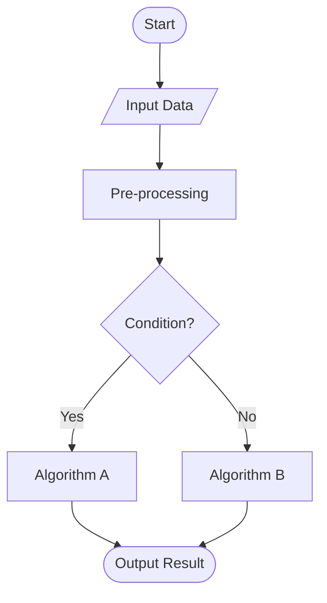
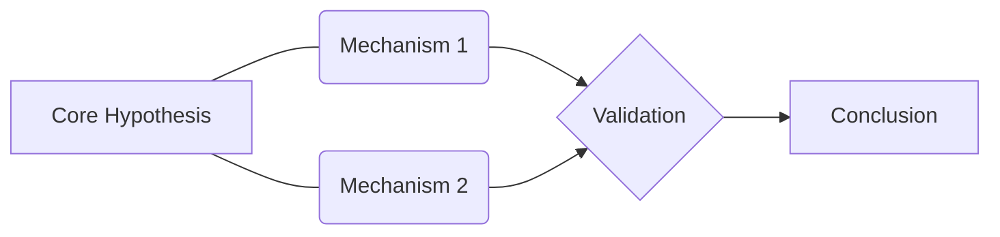

# 绘图配置与准则

## 1. Matplotlib 英语字体配置
```python
import matplotlib.pyplot as plt

# 强制设置英语字体
plt.rcParams['font.family'] = 'serif'
plt.rcParams['font.serif'] = ['Times New Roman']
plt.rcParams['axes.unicode_minus'] = False # 解决负号显示问题
```

## 2. 颜色方案
- **Okabe-Ito**: 颜色盲友好。
- **Viridis**: 感知均匀。

## 3. 导出配置 (Vector & High-Res)
### Matplotlib 导出
```python
# 导出为 PDF (推荐用于 LaTeX)
plt.savefig('figure.pdf', format='pdf', bbox_inches='tight', dpi=300)

# 导出为高分辨率 PNG (推荐用于 Word/基金申报)
plt.savefig('figure.png', format='png', bbox_inches='tight', dpi=600)
```

## 4. Mermaid 模板与渲染 (Pretty Mermaid)
### 渲染命令
参考 [Pretty-mermaid-skills](../Pretty-mermaid-skills/SKILL.md)，使用以下命令进行专业渲染：
```bash
# 渲染为 SVG (推荐)
node ../Pretty-mermaid-skills/scripts/render.mjs --input diagram.mmd --output diagram.svg --theme tokyo-night

# 渲染为 ASCII (终端预览)
node ../Pretty-mermaid-skills/scripts/render.mjs --input diagram.mmd --format ascii
```

### 算法流程图 (Flowchart)


### 逻辑关系图 (Relationship)


## 5. Draw.io 进阶配置与 AI 辅助
### AI 辅助绘图 Prompt
当需要复杂架构图时，可要求 AI 生成结构化描述：
> “请为我生成一个 [系统名称] 的架构描述，包含以下模块：[模块A, 模块B...]，并说明它们之间的连接关系。请以 CSV 格式输出，以便我导入 Draw.io。”

### 导出建议
- **Word/基金申报**：导出为 `PNG`，勾选 `Selection only`，DPI 设为 `300` 或以上。
- **LaTeX/Overleaf**：导出为 `SVG` 或 `PDF`，保持矢量特性。

## 6. 图表要素清单
- [ ] X 轴与 Y 轴标签（带单位）。
- [ ] 图例（Legend）。
- [ ] 刻度线（Ticks）。
- [ ] 标题（可选，通常在 Caption 中描述）。
