# Mermaid Diagram Skill

Text-to-diagram generation using Mermaid.js syntax. Zero external dependencies — write Mermaid code fences and render everywhere.

## When to Use

- Flowcharts and process diagrams (simple to medium complexity)
- Sequence diagrams (API flows, protocols)
- Gantt charts and timelines (project planning)
- Entity-relationship diagrams (database schema)
- Class diagrams (OOP design)
- State machines and state charts
- Git branch graphs
- Mind maps and radial diagrams
- Pie charts and simple data visualizations
- C4 architecture diagrams
- Text-first workflows (no GUI needed)

**Not ideal for**: pixel-precise layout, complex network topology, cloud architecture with official icons. Use [Draw.io](../drawio/SKILL.md) for those.

## Diagram Type Reference

### Flowchart (`graph TD` / `graph LR`)

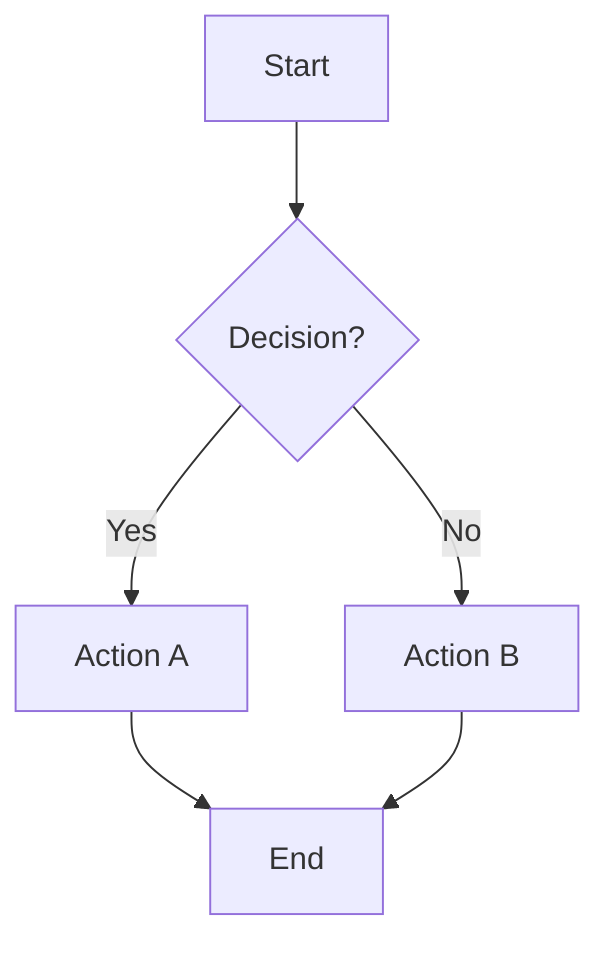

Node shapes: `[rectangle]`, `(rounded)`, `{diamond}`, `((circle))`, `[[subroutine]]`, `[(database)]`, `>flag]`

### Sequence Diagram

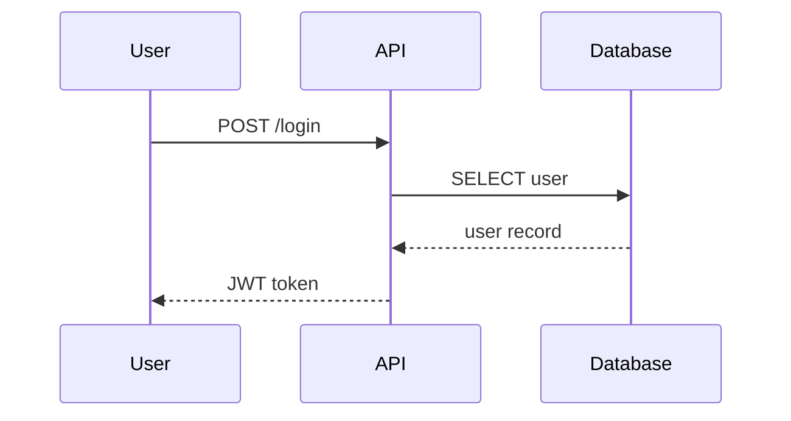

### Class Diagram

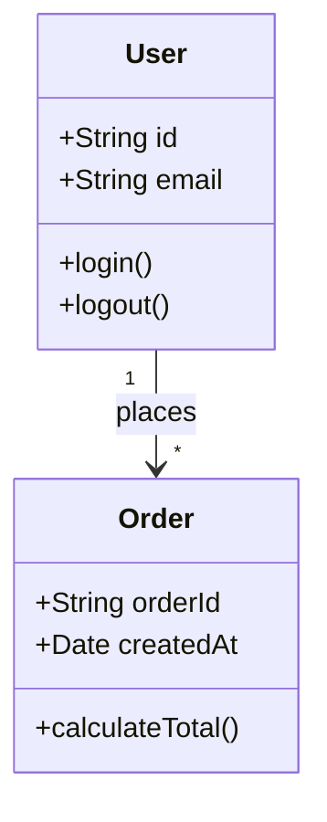

### State Diagram

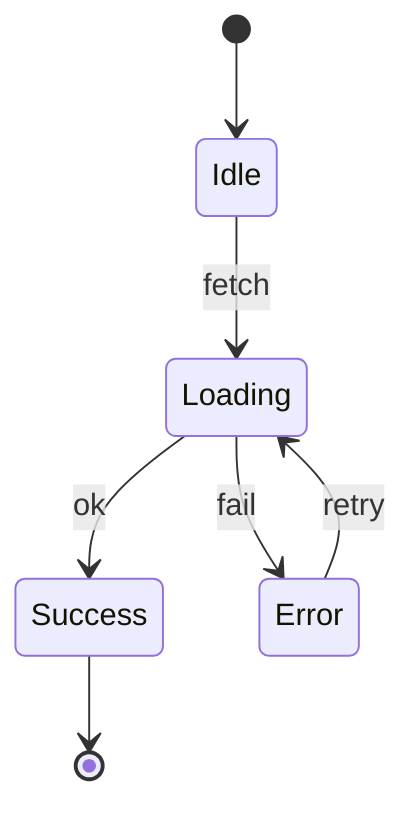

### ER Diagram

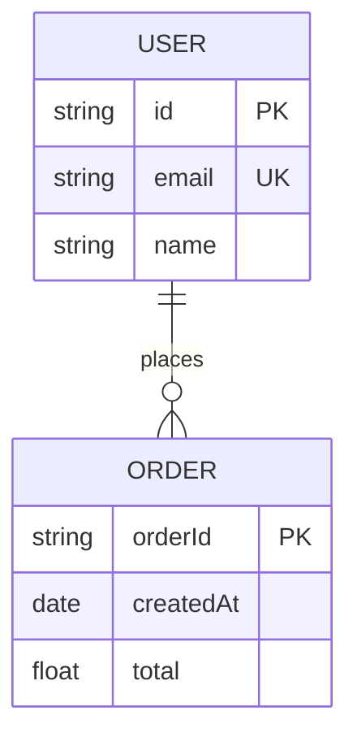

### Gantt Chart

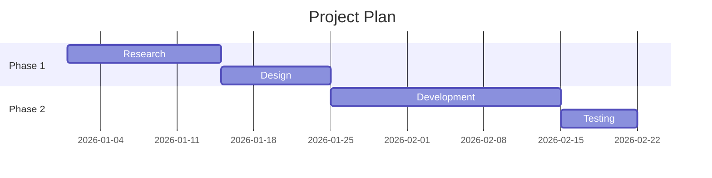

### Pie Chart

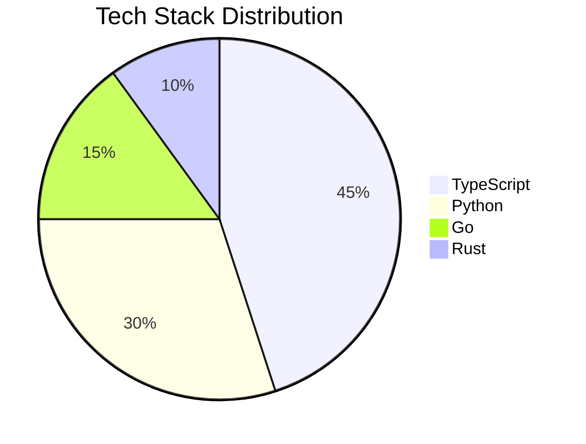

### Git Graph

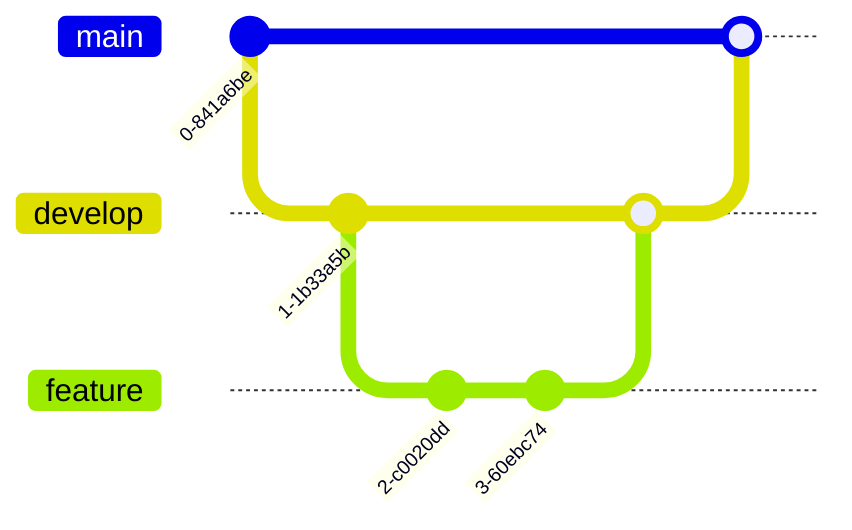

### Mind Map

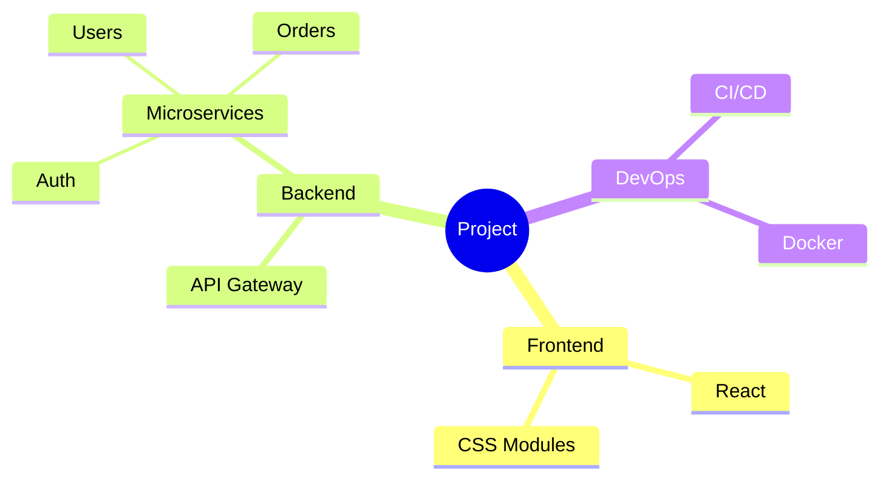

### Timeline

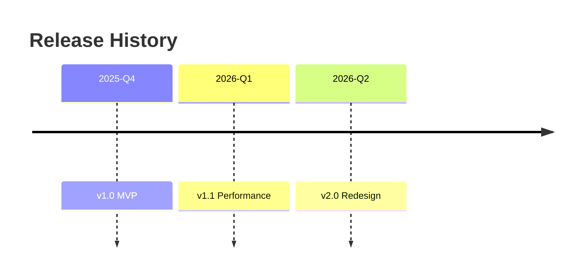

### C4 Container Diagram

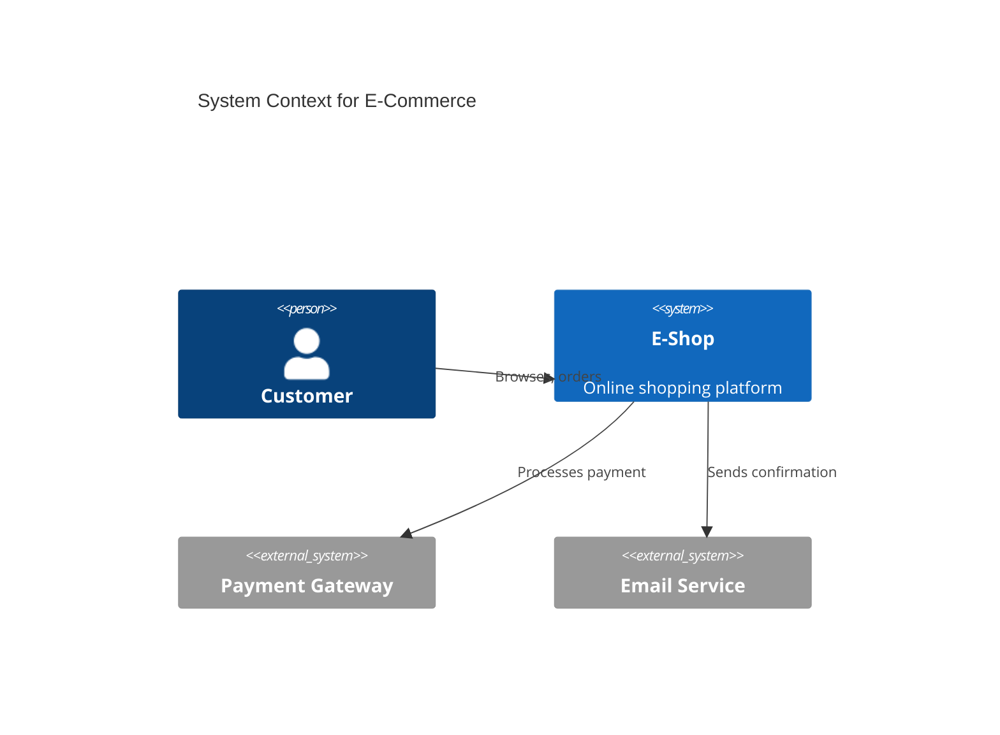

### Block Diagram (XY Chart)

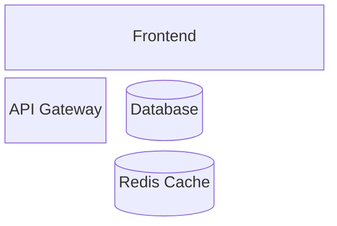

## Live Preview Options

- **GitHub**: Mermaid renders natively in markdown files
- **mermaid.live**: Paste code at https://mermaid.live for instant preview + export
- **Obsidian**: Native Mermaid support
- **Notion**: Mermaid code blocks via integration
- **VSCode**: "Mermaid Preview" extension

## Quick Tips

- Use `TD` (top-down) for flowcharts, `LR` (left-right) for wide diagrams
- Add `%%` comments to document complex diagrams
- Use subgraphs to group related nodes: `subgraph title ... end`
- Style with `classDef` and `style` for custom colors
- Link nodes with `click nodeId "url"` for interactive diagrams
- For complex diagrams, break into subgraphs rather than one flat graph

## Troubleshooting

| Issue | Solution |
|-------|----------|
| Diagram doesn't render | Check syntax at https://mermaid.live |
| Text overflows nodes | Use shorter labels or ` ` for line breaks |
| Arrows crossing | Reorder node definitions; use `LR` instead of `TD` |
| Subgraph not showing | Ensure subgraph has a title and `end` statement |
| Chinese characters garbled | Mermaid supports Unicode; check file encoding |

## Templates

See [templates/mermaid-prompts.md](./templates/mermaid-prompts.md) for 20+ copy-paste prompt templates organized by diagram type.
