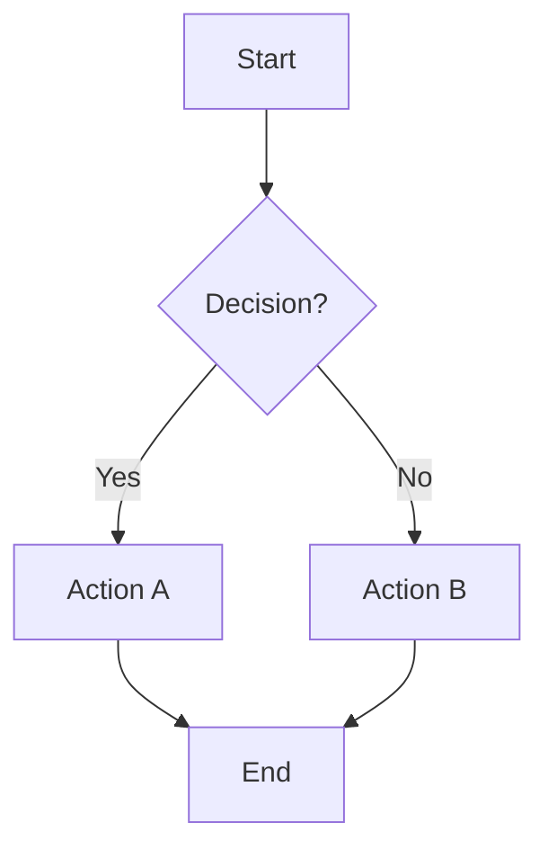
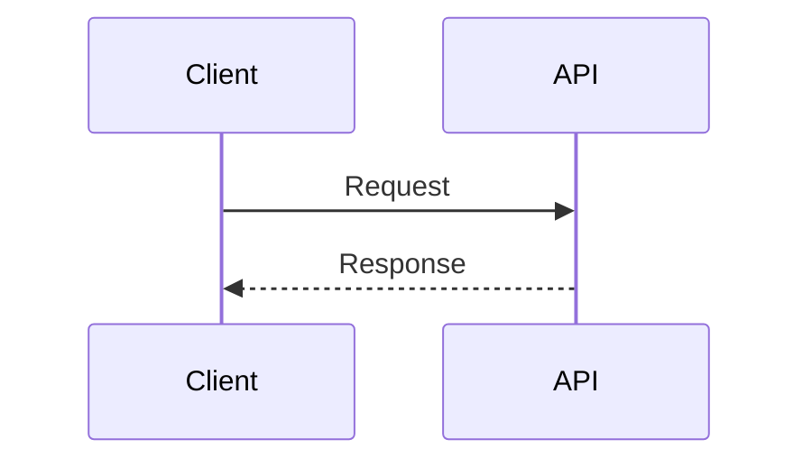
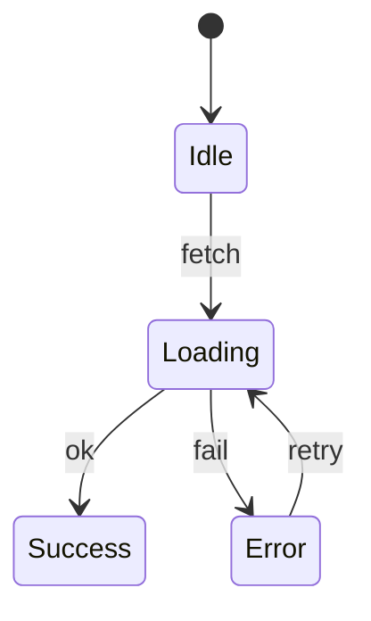
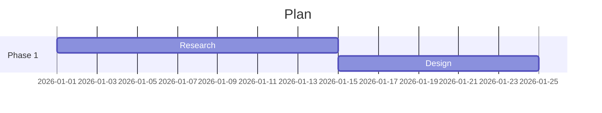
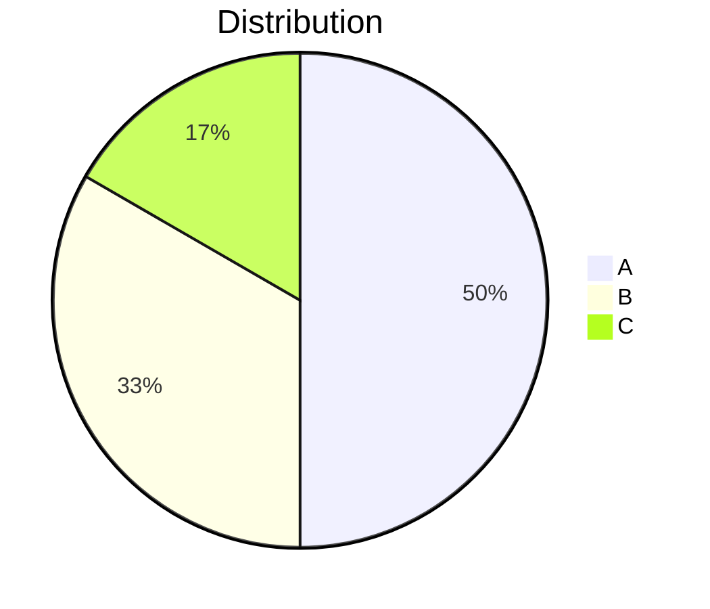
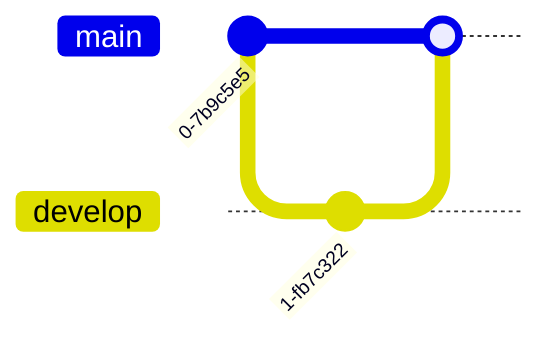
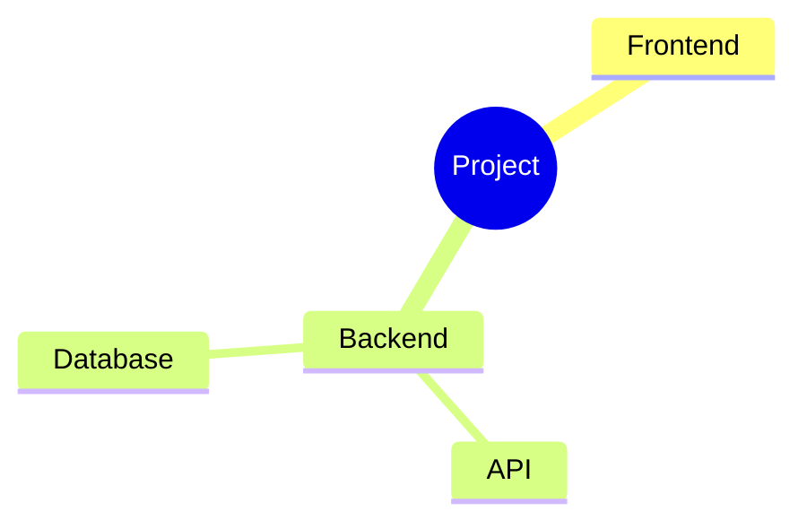
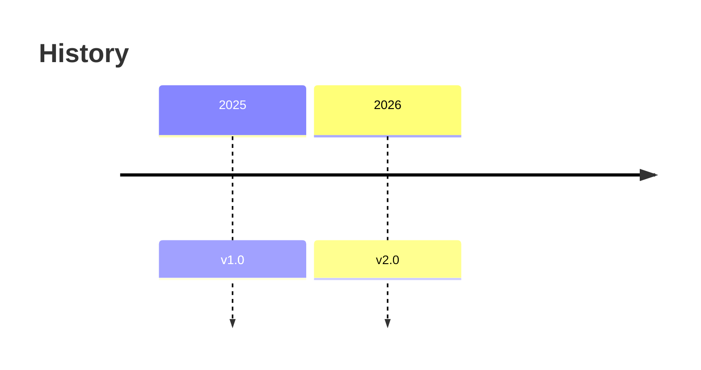
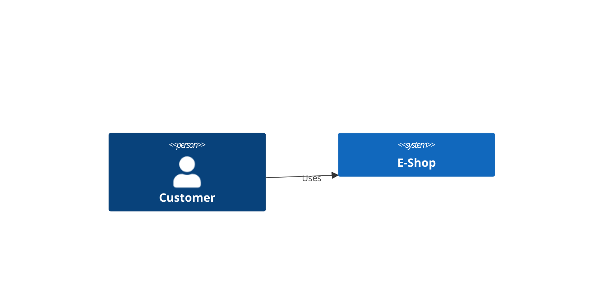
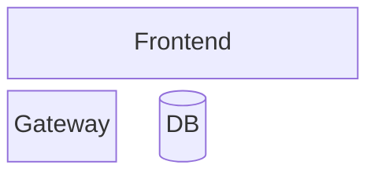

# Mermaid

Text-to-diagram generation using Mermaid.js syntax. Zero external dependencies — write Mermaid code fences that render in GitHub, Notion, Obsidian, and any Mermaid-compatible viewer.

## Dependencies

- **Submodule**: `skills/Pretty-mermaid-skills` — [imxv/Pretty-mermaid-skills](https://github.com/imxv/Pretty-mermaid-skills.git)
- **No MCP server needed** — inline code fence generation
- **Live preview**: https://mermaid.live

## When to Use

- Flowcharts (simple to medium complexity)
- Sequence diagrams (API flows, protocols)
- State machines and state charts
- Entity-relationship diagrams (database schema)
- Class diagrams (OOP design)
- Gantt charts and timelines (project planning)
- Git branch graphs
- Mind maps
- Pie charts and simple data visualizations
- C4 architecture diagrams (context, container)
- Quick markdown-embedded diagrams (GitHub/Notion/Obsidian)

## Diagram Types

### Flowchart

Node shapes: `[rectangle]`, `(rounded)`, `{diamond}`, `((circle))`, `[[subroutine]]`, `[(database)]`

### Sequence Diagram


### State Diagram


### ER Diagram
```mermaid
erDiagram
    USER ||--o{ ORDER : places
    USER { string id PK; string email UK }
    ORDER { string id PK; float total }
```

### Gantt Chart


### Pie Chart


### Git Graph


### Mind Map


### Timeline


### C4 Context


### Block Diagram


## Quick Tips

- `TD` for top-down, `LR` for left-right (wider diagrams)
- `subgraph title ... end` to group nodes
- `classDef` + `style` for custom colors
- `%%` comments for complex diagram documentation
- `click nodeId "url"` for interactive diagrams

## Live Preview Options

| Platform | How |
|----------|-----|
| mermaid.live | Paste + instant preview + export |
| GitHub | Renders natively in `.md` files |
| Obsidian | Native Mermaid plugin |
| Notion | Mermaid code blocks |
| VSCode | "Mermaid Preview" extension |

## Templates

```
Flowchart:
  Create a Mermaid graph TD: [steps] → {decision} → [pathA] / [pathB]. Use subgraphs for groups.

Sequence:
  Create a Mermaid sequence diagram: [Actor A] → [Actor B] → [Actor C]. Add Notes and activation bars.

ERD:
  Create a Mermaid erDiagram: [Entity A] ||--o{ [Entity B] : relationship. Include PK/UK/FK annotations.

State:
  Create a Mermaid stateDiagram-v2: [Initial] → [State1] → [State2]. Add transition triggers.

Gantt:
  Create a Mermaid gantt chart: dateFormat YYYY-MM-DD. [Phase] sections with [tasks] and durations.

C4:
  Create a Mermaid C4Context: Person/System/System_Ext with Rel connections.
```

## Related Resources

- [Pretty-mermaid-skills submodule](../../../skills/Pretty-mermaid-skills/) — External skill collection
- [mermaid.live](https://mermaid.live) — Interactive editor
- [Mermaid docs](https://mermaid.js.org/) — Full syntax reference
