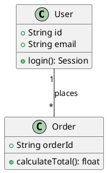
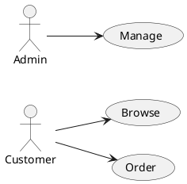
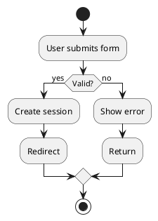
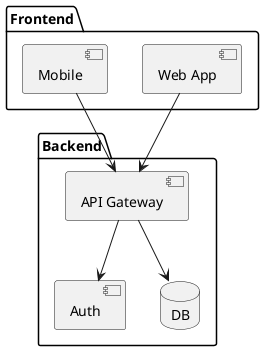
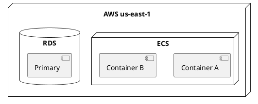
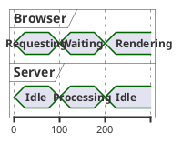

# PlantUML

Text-to-diagram for UML and beyond. Best-in-class UML coverage — class, use case, activity, component, deployment, timing, and more.

## When to Use

- UML class diagrams (best in class)
- Use case diagrams (only text-to-diagram tool with native support)
- Activity diagrams and business process models
- Component and deployment diagrams
- Timing diagrams
- When Mermaid's UML support is insufficient

**Not for**: flowcharts (use [mermaid](../mermaid/SKILL.md)), precise layouts (use [drawio](../drawio/SKILL.md)).

## Rendering Options

- https://www.plantuml.com/plantuml/ (online server)
- VSCode "PlantUML" extension
- `plantuml` CLI: `java -jar plantuml.jar diagram.puml`

## Diagram Types

### Class Diagram


### Use Case Diagram


### Activity Diagram


### Component Diagram


### Deployment Diagram


### Timing Diagram


## Templates

```
Class diagram:
  Create a PlantUML class diagram: [EntityA] with fields [type name], methods [method()]. Relationships: [EntityA] "1" -- "*" [EntityB].

Use case:
  Create a PlantUML use case diagram: actors [list], use cases [list]. Show which actor triggers which use case.

Activity:
  Create a PlantUML activity diagram: start → [step1] → if([condition]) → [true path] / [false path] → end.

Component:
  Create a PlantUML component diagram: packages [A, B], components [X, Y, Z], interfaces, dependencies.

Deployment:
  Create a PlantUML deployment diagram: nodes [server1, server2], artifacts deployed to each, communication paths.
```
