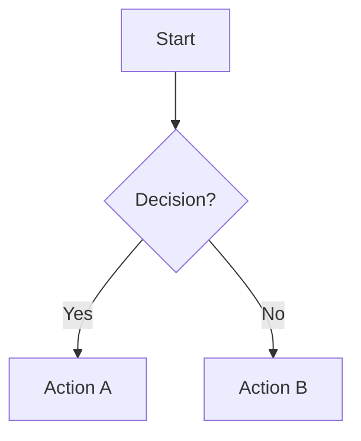
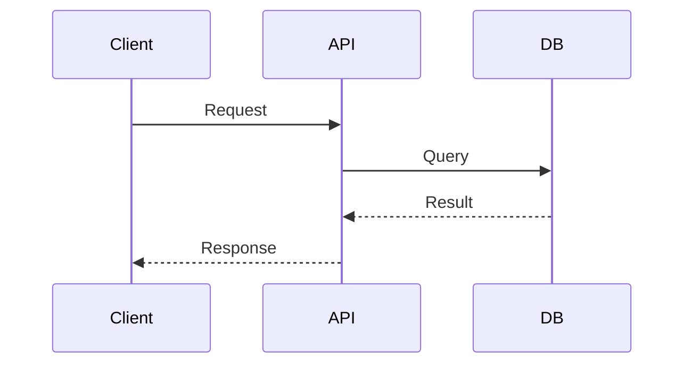

# Omnidraw Scenario Prompt Templates

Ready-to-use dispatch prompts organized by scenario. Each template includes the target sub-skill.

---

## Patent Figures (专利附图)

### Structure Diagram (结构示意图)
**→ [drawio](../drawio/SKILL.md)**
```
Draw a patent structure diagram (结构示意图) for [device/system]:
Modules: [A], [B], [C], [D]. Orthogonal connectors, 15px Chinese labels.
Black-and-white only, no grayscale. Caption: 图N [title]结构示意图.
Export PNG 300dpi.
```

### Method Flowchart (方法流程图)
**→ [drawio](../drawio/SKILL.md)**
```
Draw a patent method flowchart (方法流程图):
[step1] → [step2] → {decision} → [branchA] / [branchB].
Diamond for decision, rounded rect for steps.
15px Chinese labels, B&W, orthogonal lines.
Caption: 图N [title]方法流程图.
```

### Circuit Diagram (电路/连接图)
**→ [drawio](../drawio/SKILL.md)**
```
Draw a patent connection diagram:
[component1] connected to [component2] via [connection].
Show ports/interfaces. B&W, 15px labels, orthogonal lines.
```

---

## Academic Paper — English

### Architecture Diagram (IEEE)
**→ [drawio](../drawio/SKILL.md)**
```
Draw IEEE-compliant architecture diagram for [system]:
[N] main components, clear boundaries, grayscale.
LaTeX math labels, 300 DPI. Export EPS/PDF.
Caption: Fig. N. [Title].
```

### Pipeline / Training Flow
**→ [mermaid](../mermaid/SKILL.md) or [drawio](../drawio/SKILL.md)**
```
Create a pipeline diagram showing [process]:
Stages: [s1] → [s2] → [s3] → [s4] with data dimensions.
Suitable for [CVPR/NeurIPS/ICML/ACL]. Dual/single column as needed.
```

### Results Chart
**→ [matplotlib](../matplotlib/SKILL.md)**
```
Generate a bar chart comparing [method] vs [N] baselines:
Metrics: [m1, m2, m3]. Baselines: [names]. Ours last.
Error bars (std, 5 runs). Grayscale patterns.
Serif font 12pt, 300 DPI. Save as PDF.
```

### Mechanism Schematic
**→ [scientific-schematics](../scientific-schematics/SKILL.md)**
```
Generate a scientific schematic of [mechanism]:
Key components: [list]. Clean lines, consistent labels.
Journal-ready for [Nature/Science/Cell/...].
```

---

## Academic Paper — Chinese (中文期刊)

### 系统架构图
**→ [drawio](../drawio/SKILL.md)**
```
绘制用于[期刊名]的系统架构图：
[N]个模块：[A], [B], [C], [D]。宋体 10-12pt。
中英双语图注，灰度图，300 DPI。导出 EPS/PDF。
图题：图N [系统名]系统架构图
```

### 实验结果图
**→ [matplotlib](../matplotlib/SKILL.md)**
```
用 matplotlib 绘制实验结果对比：
指标：[m1, m2]。对比方法：[A], [B], [C], 本文方法。
柱状图，灰度区分，误差棒。SimHei 字体 12pt，300 DPI PDF。
图题：图N [实验名]结果对比
```

---

## Technical Architecture

### Microservices
**→ [drawio](../drawio/SKILL.md)**
```
Draw microservices architecture for [system]:
API Gateway → [Service A], [Service B], [Service C].
Each service has own DB. Redis cache layer. Message queue.
Layered layout: gateway → services → data.
Professional style, blue/green/gray palette.
```

### AWS Cloud
**→ [drawio](../drawio/SKILL.md)**
```
Draw AWS architecture: Route53 → CloudFront → ALB → ECS (2 AZs).
RDS Multi-AZ + read replica. ElastiCache. S3. CloudWatch.
Official AWS icons. VPC with public/private subnets.
```

### C4 Context
**→ [mermaid](../mermaid/SKILL.md)**
```
C4Context: [system]. Person/System/System_Ext.
Data flow direction on each relationship.
```

---

## Presentation / Pitch Deck

### Hero Image
**→ [nano-banana](../nano-banana/SKILL.md) (v2)**
```
16:9 hero for presentation about [topic]:
[Subject], professional modern, [brand colors].
Space for title overlay, cinematic lighting, 8k, abstract-tech style.
```

### Architecture Slide
**→ [drawio](../drawio/SKILL.md)**
```
Presentation-ready architecture: [system], max 8 components.
High-contrast for projector. 18pt+ bold labels.
Export PNG 1920x1080. [Dark/light] theme.
```

### Data Chart Slide
**→ [matplotlib](../matplotlib/SKILL.md)**
```
Presentation data chart: [type] showing [data].
16pt+ fonts, high contrast. 16:9 aspect.
Export PNG 1920x1080. Match brand colors.
```

---

## UML Modeling

### Class Diagram
**→ [plantuml](../plantuml/SKILL.md)**
```
PlantUML class diagram: [Domain] model.
[EntityA] { fields, methods }. [EntityB] { fields, methods }.
Relationships with multiplicities. Notes for invariants.
```

### Use Case
**→ [plantuml](../plantuml/SKILL.md)**
```
PlantUML use case: [System].
Actors: [list]. Use cases: [list]. Include/extend relationships.
```

---

## Quick Embedded (Markdown)

### Flowchart
**→ [mermaid](../mermaid/SKILL.md)**
````markdown

````

### Sequence
**→ [mermaid](../mermaid/SKILL.md)**
````markdown

````

### ERD
**→ [mermaid](../mermaid/SKILL.md)**
````markdown
```mermaid
erDiagram
    USER ||--o{ ORDER : places
    USER { string id PK; string email UK }
    ORDER { string id PK; float total }
```
````

---

## Visio Delivery

**→ [drawio](../drawio/SKILL.md) then [visio](../visio/SKILL.md)**
```
Step 1 (drawio): Draw [diagram type] for [purpose]. Standard shapes, orthogonal connectors. Export .drawio.
Step 2 (visio): Open .drawio in draw.io desktop → Export as VSDX.
Step 3 (visio): Polish in Visio — apply theme, add stencils, adjust page setup.
```

---

## Image Generation

### Photo-Realistic
**→ [nano-banana](../nano-banana/SKILL.md) (v2)**
```
[Subject], [environment], [lighting], [mood]. Photorealistic, [lens], professional photography, sharp focus, 8k.
```

### Illustration
**→ [gpt-image-2](../gpt-image-2/SKILL.md)**
```
A [style] illustration of [subject], [composition], [lighting], [color palette], [mood]. No text.
```

### Logo
**→ [gpt-image-2](../gpt-image-2/SKILL.md)**
```
Logo for [brand]: [key symbol], [style — minimalist/geometric], [colors]. Clean vector, white background. No text.
```

### Poster
**→ [canvas-design](../canvas-design/SKILL.md)**
```
Design a poster for [event/product]: [theme], [key visual elements], [typography], [color scheme]. Print-ready.
```
