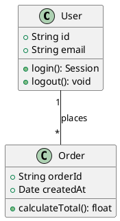
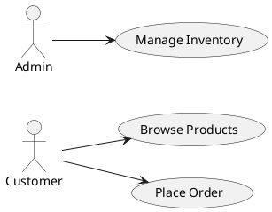
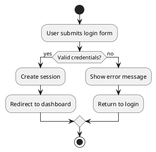
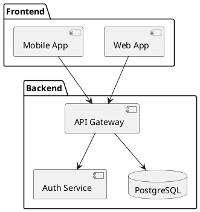
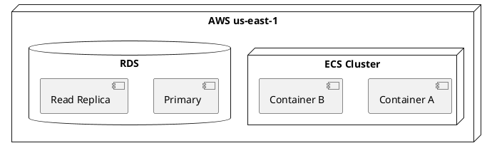
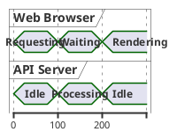

# Other Drawing Tools

Quick-reference guide for tools not covered by the dedicated skills. Each section is self-contained — pick the right tool for your task.

---

## PlantUML

### When to Use

- UML diagrams (class, use case, component, deployment, timing)
- Activity diagrams and business process models
- When Mermaid's UML support is insufficient

### Quick Start

PlantUML uses inline code fences just like Mermaid. For rendering, use:
- https://www.plantuml.com/plantuml/ (online server)
- VSCode "PlantUML" extension
- `plantuml` CLI: `java -jar plantuml.jar diagram.puml`

### Class Diagram



### Use Case Diagram



### Activity Diagram



### Component Diagram



### Deployment Diagram



### Timing Diagram



---

## Excalidraw

### When to Use

- Hand-drawn / sketch style diagrams
- Whiteboard-style architecture discussions
- Quick mockups and wireframes

### Quick Start

Excalidraw uses a JSON-based URL scheme. Generate a diagram description as JSON and open it:

```
https://excalidraw.com/#json=[URL-encoded JSON]
```

Or use the Excalidraw npm library programmatically:

```bash
npx create-excalidraw-file
```

### Key Features

- Hand-drawn aesthetic with rough.js
- Infinite canvas with zoom and pan
- Real-time collaboration via rooms
- Export: PNG, SVG, Excalidraw JSON
- Library of community shapes

### Programmatic Usage

```javascript
const elements = [
  {
    type: "rectangle",
    x: 100, y: 100,
    width: 200, height: 100,
    strokeColor: "#000000",
    backgroundColor: "#ced4da",
    roughness: 1,
    opacity: 100
  },
  {
    type: "arrow",
    x: 300, y: 300,
    width: 150, height: 0,
    points: [[0, 0], [150, 0]]
  }
];
```

---

## Matplotlib

### When to Use

- Programmatic data charts (bar, line, scatter, heatmap, etc.)
- Publication-quality figures with precise control
- Statistical visualizations (error bars, confidence intervals)
- Custom chart types not available in Mermaid

### Quick Start

```python
import matplotlib.pyplot as plt
import numpy as np

# Line chart
x = np.linspace(0, 10, 100)
y = np.sin(x)
plt.plot(x, y, label='sin(x)', color='#dae8fc', linewidth=2)
plt.xlabel('X')
plt.ylabel('Y')
plt.title('Sine Wave')
plt.legend()
plt.grid(True, alpha=0.3)
plt.savefig('chart.png', dpi=300, bbox_inches='tight')
plt.close()
```

### Chart Types

| Type | Function | Best For |
|------|----------|----------|
| Line | `plt.plot()` | Trends, time series |
| Bar | `plt.bar()`, `plt.barh()` | Comparisons |
| Scatter | `plt.scatter()` | Correlations, distributions |
| Heatmap | `plt.imshow()`, `seaborn.heatmap()` | Matrices, attention maps |
| Histogram | `plt.hist()` | Distributions |
| Box plot | `plt.boxplot()` | Statistical spread |
| Pie | `plt.pie()` | Proportions (use sparingly) |
| Stacked area | `plt.stackplot()` | Cumulative trends |
| Error bars | `plt.errorbar()` | Uncertainties |
| Subplots | `plt.subplots()` | Multi-panel figures |

### Publication-Ready Settings

```python
plt.rcParams.update({
    'font.size': 12,
    'axes.labelsize': 14,
    'axes.titlesize': 16,
    'figure.dpi': 300,
    'savefig.dpi': 300,
    'savefig.bbox': 'tight',
    'font.family': 'serif',
})
```

### Chinese Font Support

```python
plt.rcParams['font.sans-serif'] = ['SimHei', 'WenQuanYi Micro Hei', 'Noto Sans CJK SC']
plt.rcParams['axes.unicode_minus'] = False  # Fix minus sign display
```

### Decision: Matplotlib vs Mermaid vs Draw.io

| Need | Tool |
|------|------|
| Precise data from code | matplotlib |
| Quick inline chart in markdown | Mermaid |
| Stylized custom diagram | Draw.io |
| IEEE/ACM publication figure | matplotlib (data), Draw.io (architecture) |
| Interactive exploration | matplotlib (Jupyter) |

---

## Canvas Design

### When to Use

- Posters and large-format design artifacts
- Visual design with artistic direction
- Typography-heavy compositions

### Reference

Use the `canvas-design` skill when it's loaded in the environment. It's part of the Anthropic skills collection (`skills/anthropics/skills/canvas-design/SKILL.md`).

---

## Scientific Schematics

### When to Use

- Publication-quality scientific diagrams
- Mechanism diagrams for papers and proposals
- When journal-specific formatting is required

### Reference

The `claude-scientific-skills` MCP server is configured in root `mcp.json` at:
```
https://mcp.k-dense.ai/claude-scientific-skills/mcp
```

Use its MCP tools for scientific diagram generation. The `scientific-schematics` skill from `skills/claude-scientific-skills/` provides domain-specific conventions.

---

## Tool Selection Matrix

| Intent | Tool | Reason |
|--------|------|--------|
| UML class/component/deployment | PlantUML | Best UML coverage |
| Use case diagram | PlantUML | Only tool with native support |
| Hand-drawn / sketch | Excalidraw | Rough.js aesthetic |
| Data chart (precise) | matplotlib | Programmatic control |
| Data chart (quick) | Mermaid | Zero deps, inline |
| Poster / design | canvas-design | Design-focused |
| Scientific figure | scientific-schematics | Publication conventions |
| Wireframe / mockup | Excalidraw | Quick, collaborative |
