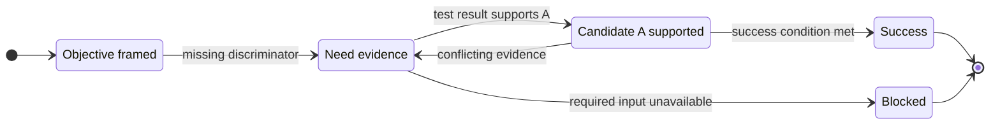
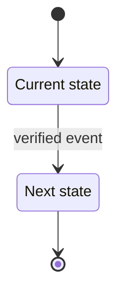

# State Machine Reasoning

Turn ambiguous analysis into an external, inspectable state graph. Model what is
currently known, what event or evidence changes it, which action follows, and
what must be verified next. Use the graph as a compact reasoning trace rather
than producing a long, unstructured chain of thoughts.

## When to Use

Use this skill for:

- decision analysis with competing options or gates;
- debugging and incident triage with hypotheses, retries, and escalation;
- research questions with hypotheses, evidence, tests, and conclusions;
- requirements, workflow, protocol, or runtime analysis;
- execution plans where the next step depends on a result.

Do not force a state machine onto a simple factual lookup or a linear answer
with no branching, uncertainty, or meaningful intermediate status.

## Operating Contract

For every applicable request:

1. Identify the objective, success condition, constraints, inputs, and unknowns.
2. Define observable states, not vague activities or hidden thoughts.
3. Define each transition with an event, guard/evidence, action, and destination.
4. Traverse only transitions supported by the supplied facts; mark assumptions.
5. Return the current state, conclusion, unresolved conditions, and next action.
6. Generate one Mermaid `stateDiagram-v2` graph from the same state/transition model.

Keep node labels short. Put detail in transition labels or the accompanying
table. Use stable identifiers such as `S0`, `S1`, and `T1` so the graph can be
edited without changing its meaning.

## State Model

Represent the model with this minimum schema before writing the diagram:

| Field | Required content |
|---|---|
| `state_id` | Stable identifier, e.g. `S0` |
| `state` | Observable status in the problem |
| `entry_criteria` | What makes the state true |
| `evidence` | Facts, measurements, or assumptions supporting it |
| `exit_condition` | Event or test that permits leaving it |
| `next_action` | Smallest useful action from this state |
| `terminal` | `success`, `rejected`, `inconclusive`, `failure`, `blocked`, or `false` |

Each transition uses:

```text
T{id}: S_from --[event | guard/evidence]--> S_to
Action: {what to do}
Result: {what changes or is learned}
Confidence: {high | medium | low | assumption}
```

Use explicit states for:

- `Initial` — the objective is accepted and the input boundary is known;
- `NeedEvidence` — a decision is blocked by a missing fact or test;
- `Branch` — two or more mutually exclusive paths are possible;
- `Retry` — the previous action failed but a bounded retry is justified;
- `QualityCheck` — the evidence or result is being checked for validity;
- `Success` — the requested success condition is met;
- `Rejected` — a candidate, hypothesis, or option failed its stated criterion;
- `Inconclusive` — the available evidence cannot support a decision;
- `Revise` — the model, hypothesis, or plan needs an explicit revision;
- `Blocked` — progress requires an external input or decision;
- `Failure` — the objective cannot be met under the stated constraints.

Only include these states when they occur. Do not add decorative nodes.

## Analysis Procedure

### 1. Frame the problem

Write one sentence for the objective and one sentence for the success
condition. Separate facts, user constraints, assumptions, and unknowns.

If the objective is underspecified, create `NeedClarification` as a state and
list the smallest question that would unlock the next transition.

### 2. Extract states

Convert each meaningful status into a state. A good state is:

- observable from the available evidence;
- mutually distinguishable from adjacent states;
- useful for choosing the next action;
- concise enough to fit in a diagram node.

Prefer `Hypothesis untested` over `Investigate`, and `Evidence supports A`
over `Think about A`.

### 3. Add transitions

For every edge, answer all four questions:

1. What event, observation, or user choice triggers it?
2. What guard or evidence makes it valid?
3. What action occurs at the edge or destination?
4. What state becomes true afterward?

Add explicit alternate, failure, retry, timeout, and rollback edges whenever
they affect the conclusion. Bound retries with a count or a stopping rule.

### 4. Traverse and analyze

Start at `Initial` and follow the strongest currently supported path. At each
transition, record a short rationale consisting of the evidence and the
decision it supports. When evidence conflicts, retain both branches and mark
the result as unresolved until a discriminator is identified.

Do not turn an assumption into a fact. Label uncertain edges as `assumption`,
`to verify`, or `low confidence`, and route them through `NeedEvidence` when
they affect the outcome.

For hypothesis or experiment analysis, use this completeness rule:

1. Lock the hypothesis, comparison, metric, threshold, and stopping rule before
   interpreting results.
2. Separate `Evidence collected` from `Quality check`; a negative result with
   invalid measurement is not the same as a rejected hypothesis.
3. Provide distinct terminal paths for `Supported`, `Rejected`, and
   `Inconclusive`.
4. Route confounding factors, invalid controls, or measurement failures to
   `Revise`, not directly to `Rejected`.
5. Give every data-collection loop a finite sample, time, cost, or iteration
   budget. When it is exhausted, transition to `Inconclusive` or `Blocked`.

### 5. Render the graph

Generate Mermaid from the finalized model, not independently from prose:



Use `direction LR` for wide workflows and `direction TB` for compact
decision trees. Keep Mermaid identifiers ASCII; put the user-facing language
in quoted labels. Escape quotes and line breaks in labels. Avoid unsupported
HTML or tool-specific syntax.

When a file artifact is requested, save the source first, for example:

```bash
cat > state-machine.mmd <<'EOF'
stateDiagram-v2
...
EOF

# SVG is the primary rendered artifact; PNG is an optional convenience copy.
mmdc -i state-machine.mmd -o state-machine.svg
mmdc -i state-machine.mmd -o state-machine.png --scale 2
```

If `mmdc` is unavailable, return the complete `.mmd` content and the exact
render command as a follow-up. Do not describe an SVG or PNG as generated
until the file exists and has been checked.

## Response Format

Use this structure unless the user asks for a different format:

~~~markdown
## Problem Frame
- Objective:
- Success condition:
- Facts:
- Assumptions / unknowns:

## Current State
`S{id}` — {state}

## State / Transition Table
| ID | From | Event / guard | Action | Evidence | To |
|---|---|---|---|---|---|
| T1 | S0 | ... | ... | ... | S1 |

## Conclusion
{short conclusion tied to the traversed transitions}

## Next Action
{one smallest action, or the missing input that creates the next transition}

## Mermaid Visualization


## Artifacts
- Source: `state-machine.mmd`
- SVG: `state-machine.svg` (when rendered and verified)
- PNG: `state-machine.png` (when rendered and verified)
~~~

For a simple request, compress the table and prose, but preserve the graph and
the current-state/next-action pair.

## Domain Patterns

### Decision analysis

Use states such as `Options identified`, `Criteria weighted`, `Option A
selected`, and `Decision pending`. Transitions must include constraints,
trade-offs, and the condition that would change the decision.

### Debugging

Use states such as `Symptom reproduced`, `Hypothesis ranked`, `Test running`,
`Cause confirmed`, `Fix validated`, and `Rollback`. A fix is not a terminal
success state until the original symptom check passes.

### Research and investigation

Use a complete path such as:

`Question framed` → `Hypothesis and criteria locked` → `Experiment designed`
→ `Evidence collected` → `Quality check` → one of `Hypothesis supported`,
`Hypothesis rejected`, or `Inconclusive`.

Add `Revise hypothesis or design` when a confounder, invalid control, or
measurement problem is found. `More data needed` may return to collection only
while the declared data budget remains; otherwise it must end in `Inconclusive`
or `Blocked`. Separate observed evidence from interpretation throughout.

### Workflow or system design

Use states that describe lifecycle status. Put actors, events, API calls, or
timers on transitions. Add timeout, rejection, cancellation, and recovery
paths when they are part of the requested behavior.

## Quality Gate

Before responding, verify:

- one and only one initial entry is present;
- every reachable nonterminal state has an exit condition or is explicitly
  `Blocked`;
- every conclusion cites the transition(s) that support it;
- alternate and failure paths do not silently disappear;
- assumptions and unknowns are visible;
- hypothesis workflows have distinct support, rejection, and inconclusive
  outcomes;
- evidence-quality failures route to revision rather than being misclassified
  as hypothesis rejection;
- every retry or data-collection loop has a visible stopping rule;
- the Mermaid graph matches the table and uses valid `stateDiagram-v2` syntax;
- requested image files exist, are non-empty, and correspond to the source;
- the final answer is concise and does not expose a verbatim private reasoning
  transcript.

## Common Mistakes

| Mistake | Correction |
|---|---|
| Nodes are actions, not states | Rewrite them as observable statuses |
| Every edge says `next` | Label the event, guard, and evidence |
| One happy path only | Add supported alternate, failure, retry, and blocked edges |
| Diagram and prose diverge | Treat the state/transition table as the source of truth |
| Infinite retry loop | Add a retry budget, timeout, or escalation edge |
| Unverified conclusion | Route missing evidence through `NeedEvidence` |
| No rejection path | Add a terminal `Rejected` state with its criterion |
| Invalid experiment treated as negative evidence | Add `QualityCheck` and `Revise` states |
| “More data” loops forever | Declare a finite sample, time, cost, or iteration budget |
| Claimed image output without a file | Render, inspect, and report the actual artifact path |
